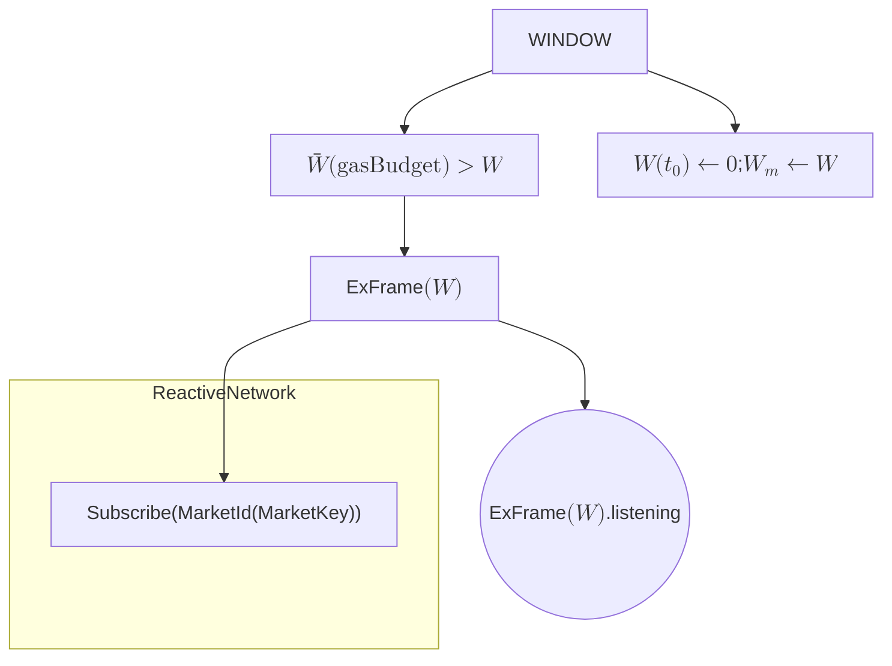

Implement:

[REF](https://dev.reactive.network/)

```mermaid
flowchart TD
 
    WindowGasBound["$$\bar W (\texttt{gasBudget}) > W$$"]
    ExFrame["ExFrame$$(W)$$"]

    ExFrameState(("ExFrame$$(W)$$.listening"))

    WindowState["$$W (t_0) \leftarrow 0$$
    ;$$W_m \leftarrow W$$"]

    subgraph Reactive["ReactiveNetwork"]
        subscribe["Subscribe(MarketId(MarketKey))"]
    end

    WINDOW --> WindowGasBound --> ExFrame --> ExFrameState
    WINDOW --> WindowState
    ExFrame --> subscribe
```

